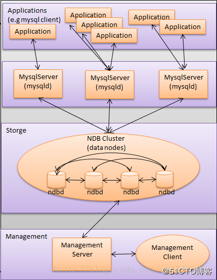
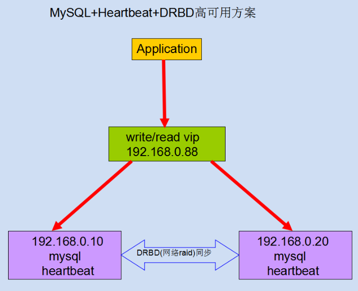
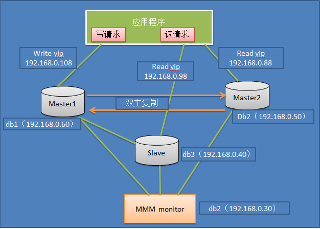

# About Big Data Store And Analysic

一篇有关大数据量存储及分析的讨论

## 目录

## 概述

首先整理下跟大数据量存储及分析可能相关的技术及中间件

- Hadoop生态(Hbase, Spark, Hive等)
- Elasticsearch
- TiDB
- MySQL集群
- Greenplum
- PostgreSQL
- MPP

## 关心的问题

在关于大数据量的存储及分析的讨论时，我们比较关注于这些方案的如下方面：

- 在某个硬件资源设定下，最大支持多大数据量的存储
- 在某个级别数据量规模下，数据分析的性能如何
- 在某个级别数据量规模下，稳定性如何
- 后续集群规模需要扩展的情况下，扩展性如何？
- 集群最大规模是多少
- 管理集群是否有可靠方案
- 实施这套存储和分析方案，需要什么样的人员，多少？什么级别？

## Hadoop生态

## Elasticsearch

## TiDB

## MySQL集群

### MySQL集群参考文档一

[浅淡MySQL集群高可用架构](http://blog.51cto.com/mingongge/2052768)

第一种 主从同步架构

此种架构，一般初创企业比较常用，也便于后面步步的扩展

此架构特点：

1. 成本低，布署快速、方便
2. 读写分离
3. 还能通过及时增加从库来减少读库压力
4. 主库单点故障
5. 数据一致性问题（同步延迟造成）

第二种 Mysql+DRBD架构

通过DRBD基于block块的复制模式，快速进行双主故障切换，很大程度上解决主库单点故障问题

此架构特点：

1. 高可用软件可使用Heartbeat,全面负责VIP、数据与DRBD服务的管理
2. 主故障后可自动快速切换，并且从库仍然能通过VIP与新主库进行数据同步
3. 从库也支持读写分离，可使用中间件或程序实现

>DRBD 是内核模块方式实现的块级别同步复制技术、这里的同步级别是可以调整的。因为DRBD 是利用网卡进行块复制、如果这里用 Infiniband 进行传输、便可以有效处理高并发。这是种复制存储、说白点、更像是一台热备机器、与其说是存储的HA、倒不如说是保证数据安全。\
工业环境更多用在 NFS 服务器、并结合 Linux-HA 项目、如 Packmaker、Heartbeat 等\
\
很多人谈 DRBD 脑裂而色变、用过就知道了、脑裂不是那么容易就发生的，DRBD 注意不设置自动启动、重启时候手动启动、脑裂的情况发生非常的少。\
工作中基本不重启 DRBD、更不会重启服务器了、基本上没遇到脑裂的问题\
\
摘自 [MySQL 磁盘复制技术--DRBD：优缺点比较、注意事项以及最佳实践](https://www.linuxidc.com/Linux/2013-06/85235.htm)

[Heartbeat+DRBD+MySQL高可用方案](https://www.cnblogs.com/gomysql/p/3674030.html)

第三种 Mysql+MHA架构

MHA目前在Mysql高可用方案中应该也是比较成熟和常见的方案，它由日本人开发出来，在mysql故障切换过程中，MHA能做到快速自动切换操作，而且还能最大限度保持数据的一致性

此架构特点：

1. 安装布署简单，不影响现有架构
2. 自动监控和故障转移
3. 保障数据一致性
4. 故障切换方式可使用手动或自动多向选择
5. 适应范围大（适用任何存储引擎）

第四种 Mysql+MMM架构

MMM即Master-Master Replication Manager for MySQL（mysql主主复制管理器），是关于mysql主主复制配置的监控、故障转移和管理的一套可伸缩的脚本套件（在任何时候只有一个节点可以被写入），这个套件也能基于标准的主从配置的任意数量的从服务器进行读负载均衡，所以你可以用它来在一组居于复制的服务器启动虚拟ip，除此之外，它还有实现数据备份、节点之间重新同步功能的脚本。

MySQL本身没有提供replication failover的解决方案，通过MMM方案能实现服务器的故障转移，从而实现mysql的高可用。

此方案特点：

1. 安全、稳定性较高，可扩展性好
2. 对服务器数量要求至少三台及以上
3. 对双主（主从复制性要求较高）
4. 同样可实现读写分离

第五种 官方mysql cluster方案

Mysql官方推出的集群高可用方案，由于本人没有用过，不好评价

摘自网络上的一段解释

>MySQL Cluster 由一组计算机构成，每台计算机上均运行着多种进程，包括 MySQL 服务器，NDB Cluster的数据节点，管理服务器，以及（可能）专门的数据访问程序。\
由于MySQL Cluster架构复杂，部署费时（通常需要DBA几个小时的时间才能完成搭建），而依靠 MySQL Cluster Manager 只需一个命令即可完成，但 MySQL Cluster Manager 是收费的。并且业内资深人士认为NDB 不适合大多数业务场景，而且有安全问题。因此，使用的人数较少。\
\
有兴趣的可以研究下官方文档：\
https://dev.mysql.com/doc/refman/5.7/en/mysql-cluster-install-linux.html

参考[浅淡MySQL集群高可用架构](http://blog.51cto.com/mingongge/2052768)

### MySQL集群参考文档二

[MySQLFabric、MySQL分片高可用集群之MySQLCluster、较成熟的集群方案GaleraCluster的部署使用优缺点详细讲解](https://www.2cto.com/database/201804/736048.html)

### MySQL集群参考文档三

[MySQL常用集群方案](https://blog.csdn.net/annotation_yang/article/details/80860988)

### MySQL集群参考文档四

组建MySQL集群的几种方案

- LVS+Keepalived+MySQL（有脑裂问题？但似乎很多人推荐这个）
- DRBD+Heartbeat+MySQL（有一台机器空余？Heartbeat切换时间较长？有脑裂问题？）
- MySQL Proxy（不够成熟与稳定？使用了Lua？是不是用了他做分表则可以不用更改客户端逻辑？）
- MySQL Cluster （社区版不支持INNODB引擎？商用案例不足？）
- MySQL + MHA （如果配上异步复制，似乎是不错的选择，又和问题？）
- MySQL + MMM （似乎反映有很多问题，未实践过，谁能给个说法）

回答：

不管哪种方案都是有其场景限制 或说 规模限制，以及优缺点的。

1. 首先反对大家做读写分离，关于这方面的原因解释太多次数（增加技术复杂度、可能导致读到落后的数据等），只说一点：99.8%的业务场景没有必要做读写分离，只要做好数据库设计优化 和配置合适正确的主机即可。
2. Keepalived+MySQL --确实有脑裂的问题，还无法做到准确判断mysqld是否HANG的情况；
3. DRBD+Heartbeat+MySQL --同样有脑裂的问题，还无法做到准确判断mysqld是否HANG的情况，且DRDB是不需要的，增加反而会出问题；
4. MySQL Proxy -- 不错的项目，可惜官方半途夭折了，不建议用，无法高可用，是一个写分离；
5. MySQL Cluster -- 社区版本不支持NDB是错误的言论，商用案例确实不多，主要是跟其业务场景要求有关系、这几年发展有点乱不过现在已经上正规了、对网络要求高；
6. MySQL + MHA -- 可以解决脑裂的问题，需要的IP多，小集群是可以的，但是管理大的就麻烦，其次MySQL + MMM 的话且坑很多，有MHA就没必要采用MMM

建议：

1. 若是双主复制的模式，不用做数据拆分，那么就可以选择MHA或 Keepalive 或 heartbeat
2. 若是双主复制，还做了数据的拆分，则可以考虑采用Cobar；
3. 若是双主复制+Slave，还做了数据的拆分，需要读写分类，可以考虑Amoeba；

上述所有的内容都要依据公司内部的业务场景、数据量、访问量、并发量、高可用的要求、DBA人群的数量等 综合权衡

>脑裂\
\
在高可用（HA）系统中，当联系2个节点的“心跳线”断开时，本来为一整体、动作协调的HA系统，就分裂成为2个独立的个体。由于相互失去了联系，都以为是对方出了故障。两个节点上的HA软件像“裂脑人”一样，争抢“共享资源”、争起“应用服务”，就会发生严重后果——或者共享资源被瓜分、2边“服务”都起不来了；或者2边“服务”都起来了，但同时读写“共享存储”，导致数据损坏（常见如数据库轮询着的联机日志出错）。\
\
参考 [脑裂](../distributed-system/brain-split.md)

[MySQL集群的几种方案](https://www.cnblogs.com/pangguoming/p/8241007.html)

### MySQL集群参考文档五

总结：

目前高可用方案可以一定程度上实现数据库的高可用，比如前面文章介绍的MMM，heartbeat+drbd，Cluster等。还有percona的Galera Cluster等。这些高可用软件各有优劣。在进行高可用方案选择时，主要是看业务还有对数据一致性方面的要求。最后出于对数据库的高可用和数据一致性的要求，推荐使用MHA架构。

[MySQL高可用架构之MHA](https://www.cnblogs.com/gomysql/p/3675429.html)

简介：

MHA（Master High Availability）目前在MySQL高可用方面是一个相对成熟的解决方案，它由日本DeNA公司youshimaton（现就职于Facebook公司）开发，是一套优秀的作为MySQL高可用性环境下故障切换和主从提升的高可用软件。在MySQL故障切换过程中，MHA能做到在0~30秒之内自动完成数据库的故障切换操作，并且在进行故障切换的过程中，MHA能在最大程度上保证数据的一致性，以达到真正意义上的高可用。

**该软件由两部分组成：MHA Manager（管理节点）和MHA Node（数据节点）**。MHA Manager可以单独部署在一台独立的机器上管理多个master-slave集群，也可以部署在一台slave节点上。MHA Node运行在每台MySQL服务器上，MHA Manager会定时探测集群中的master节点，当master出现故障时，它可以自动将最新数据的slave提升为新的master，然后将所有其他的slave重新指向新的master。整个故障转移过程对应用程序完全透明。

在MHA自动故障切换过程中，MHA试图从宕机的主服务器上保存二进制日志，最大程度的保证数据的不丢失，但这并不总是可行的。例如，如果主服务器硬件故障或无法通过ssh访问，MHA没法保存二进制日志，只进行故障转移而丢失了最新的数据。使用MySQL 5.5的半同步复制，可以大大降低数据丢失的风险。MHA可以与半同步复制结合起来。如果只有一个slave已经收到了最新的二进制日志，MHA可以将最新的二进制日志应用于其他所有的slave服务器上，因此可以保证所有节点的数据一致性。

目前MHA主要支持一主多从的架构，**要搭建MHA,要求一个复制集群中必须最少有三台数据库服务器**，一主二从，即一台充当master，一台充当备用master，另外一台充当从库，因为至少需要三台服务器，出于机器成本的考虑，淘宝也在该基础上进行了改造，目前淘宝TMHA已经支持一主一从。另外对于想快速搭建的可以参考：[MHA快速搭建](http://www.cnblogs.com/gomysql/p/6547797.html)

我们自己使用其实也可以使用1主1从，但是master主机宕机后无法切换，以及无法补全binlog。master的mysqld进程crash后，还是可以切换成功，以及补全binlog的。

官方介绍：https://code.google.com/p/mysql-master-ha/

[Heartbeat+DRBD+MySQL高可用方案](http://www.cnblogs.com/gomysql/p/3674030.html)

1.方案简介

本方案采用Heartbeat双机热备软件来保证数据库的高稳定性和连续性，数据的一致性由DRBD这个工具来保证。默认情况下只有一台mysql在工作，当主mysql服务器出现问题后，系统将自动切换到备机上继续提供服务，当主数据库修复完毕，又将服务切回继续由主mysql提供服务。

2.方案优缺点

优点：安全性高、稳定性高、可用性高，出现故障自动切换。

缺点：只有一台服务器提供服务，成本相对较高，不方便扩展，可能会发生脑裂。

3.软件介绍

Heartbeat介绍

官方站点：http://linux-ha.org/wiki/Main_Page

heartbeat可以资源(VIP地址及程序服务)从一台有故障的服务器快速的转移到另一台正常的服务器提供服务，heartbeat和keepalived相似，heartbeat可以实现failover功能，但不能实现对后端的健康检查

DRBD介绍

官方站点：http://www.drbd.org/

DRBD(DistributedReplicatedBlockDevice)是一个基于块设备级别在远程服务器直接同步和镜像数据的软件，用软件实现的、无共享的、服务器之间镜像块设备内容的存储复制解决方案。它可以实现在网络中两台服务器之间基于块设备级别的实时镜像或同步复制(两台服务器都写入成功)/异步复制(本地服务器写入成功)，相当于网络的RAID1，由于是基于块设备(磁盘，LVM逻辑卷)，在文件系统的底层，所以数据复制要比cp命令更快。DRBD已经被MySQL官方写入文档手册作为推荐的高可用的方案之一

4.方案拓扑

[MySQL Cluster搭建与测试](http://www.cnblogs.com/gomysql/p/3664783.html)

>MySQL Cluster 优点和缺点\
优点：\
1)MySQL Cluster 自动将表分片（或分区）到不同节点上，使数据库可以在低成本的商用硬件上横向扩展，同时保持对应用程序完全应用透明。\
2)凭借其分布式、无共享架构，MySQL Cluster 可提供 99.999% 的可用性，确保了较强的故障恢复能力和在不停机的情况下执行预定维护的能力。\
3)MySQL Cluster 让用户可以在解决方案中整合关系数据库技术和 NoSQL 技术中的最佳部分，从而降低成本、风险和复杂性。\
4)MySQL Cluster 提供实时的响应时间和吞吐量，能满足最苛刻的 Web、电信及企业应用程序的需求。\
5)具有跨地域复制功能的多站点集群\
跨地域复制使多个集群可以分布在不同的地点，从而提高了灾难恢复能力和全球 Web 服务的扩展能力。\
6)为支持持续运营，MySQL Cluster 允许向正在运行的数据库模式中联机添加节点和更新内容，因而能支持快速变化和高度动态的负载。 \
\
缺点\
1)随数据库容量增加，每个数据数据节点需要添加更多的内存，增加使用成本\
2)牺牲部分sql语言特性。\
\
参考 [MySQL Cluster 优点和缺点](https://blog.csdn.net/zdc524/article/details/50522856 )

[MySQL Cluster 常见问题](https://www.mysql.com/products/cluster/faq.html)

Q: Is MySQL Cluster Manager open source software?

A: No. MySQL Cluster Manager is available only as a part of the commercial MySQL Cluster Carrier Grade Edition (CGE) database. To purchase subscriptions or licenses for MySQL Cluster CGE, please contact the MySQL Sales Team.

Q: What is MySQL Cluster Manager?

A: MySQL Cluster Manager is software which simplifies the creation and management of the MySQL Cluster database by automating common management tasks.

收费的可能只是MySQL Cluster Manager而不是MySQL Cluster

Q: MySQL Cluster是否收费

A: MySQL是个公司，其产品有两种license：GPL和commercial Lic。官方网站可下载GPL版本。

ndb的研发很快，更新比较频繁，建议lz用ndb-7.0.x吧

仔细看手册里面关于ndb cluster限制的那一部分，ndb不是通用型数据库产品；对应用、数据库设计有很多特殊要求

[MySQL 高可用架构之MMM](http://www.cnblogs.com/gomysql/p/3671896.html)

简介

MMM（Master-Master replication manager for MySQL）是一套支持双主故障切换和双主日常管理的脚本程序。MMM使用Perl语言开发，主要用来监控和管理MySQL Master-Master（双主）复制，虽然叫做双主复制，但是业务上同一时刻只允许对一个主进行写入，另一台备选主上提供部分读服务，以加速在主主切换时刻备选主的预热，可以说MMM这套脚本程序一方面实现了故障切换的功能，另一方面其内部附加的工具脚本也可以实现多个slave的read负载均衡。

MMM提供了自动和手动两种方式移除一组服务器中复制延迟较高的服务器的虚拟ip，同时它还可以备份数据，实现两节点之间的数据同步等。由于MMM无法完全的保证数据一致性，所以MMM适用于对数据的一致性要求不是很高，但是又想最大程度的保证业务可用性的场景。**对于那些对数据的一致性要求很高的业务，非常不建议采用MMM这种高可用架构**。

MMM项目来自 Google：http://code.google.com/p/mysql-master-master

官方网站为：http://mysql-mmm.org

下面我们通过一个实际案例来充分了解MMM的内部架构，如下图所示。

## PostgreSQL集群

### PG参考文档一

[PostgreSQL的集群技术比较](https://blog.csdn.net/hxpjava1/article/details/80366841)

### PG参考文档二

[PG的两种集群技术：Pgpool-II与Postgres-XL](https://segmentfault.com/a/1190000007012082)

这篇文章经过小数据量对比后推荐`Postgres-XL`

### PG参考文档三

[postgresql 集群和同步以及企业解决方案](http://panyongzheng.iteye.com/blog/2211073)

### PG参考文档四

[Postgresql集群搭建与PostGIS安装](https://blog.csdn.net/fct2001140269/article/details/80812356)

## MPP

MPP即大规模并行处理（Massively Parallel Processor ）。 在数据库非共享集群中，每个节点都有独立的磁盘存储系统和内存系统，业务数据根据数据库模型和应用特点划分到各个节点上，每台数据节点通过专用网络或者商业通用网络互相连接，彼此协同计算，作为整体提供数据 库服务。非共享数据库集群有完全的可伸缩性、高可用、高性能、优秀的性价比、资源共享等优势。

MPP架构特征

- 任务并行执行
- 数据分布式存储(本地化)
- 分布式计算
- 私有资源
- 横向扩展
- Shared Nothing架构

常见MPPDB

- GREENPLUM(EMC)
- Asterdata(Teradata)
- Nettezza(IBM)
- Vertica(HP)
- GBase 8a MPP cluster(南大通用)

MPPDB、Hadoop与传统数据库技术对比与适用场景

对比表格参考[MPP(大规模并行处理)简介](https://blog.csdn.net/qq_42189083/article/details/80610092)

>elasticsearch也是一种MPP架构的数据库，Presto、Impala等都是MPP engine，各节点不共享资源，每个executor可以独自完成数据的读取和计算，缺点在于怕stragglers，遇到后整个engine的性能下降到该straggler的能力，所谓木桶的短板，这也是为什么MPP架构不适合异构的机器，要求各节点配置一样。\
\
Spark SQL应该还是算做Batching Processing, 中间计算结果需要落地到磁盘，所以查询效率没有MPP架构的引擎（如Impala）高。\
引用[MPP(大规模并行处理)简介](https://blog.csdn.net/qq_42189083/article/details/80610092)

## 其他问题

### 关系型数据库的选型

### 需要的硬件资源

### 改造点

### 改造工作量

### 改造工作时长

### 应用层使用什么样的程序来访问

### 改造后，是否支持sql存储过程之类的来生成报表、指标等

## 参考资料

### MPP部分

- [Hadoop 和 MPP 的比较【详细】](https://www.jianshu.com/p/5191daa1a454)
- [大数据基础知识问答----spark篇](https://blog.csdn.net/wangyaninglm/article/details/52403425?utm_source=blogxgwz6)
- [MPP架构](https://www.cnblogs.com/jianyungsun/p/9261632.html)
- [MPP(大规模并行处理)简介](https://blog.csdn.net/qq_42189083/article/details/80610092)

### Greenplum部分

- [Greenplum介绍](https://blog.csdn.net/dcpkeke/article/details/79003170)
- [Greenplum企业应用实战（笔记）：第七章 Greenplum 架构介绍](https://www.jianshu.com/p/105cb516a122)
- [海量数据处理利器greenplum——初识](https://www.cnblogs.com/skyme/p/5779885.html)
