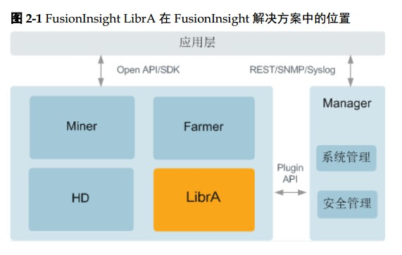

# MPP Intrudation And Comparison

MPP介绍及不同产品对比

## MPP

MPP即大规模并行处理（Massively Parallel Processor ）。 在数据库非共享集群中，每个节点都有独立的磁盘存储系统和内存系统，业务数据根据数据库模型和应用特点划分到各个节点上，每台数据节点通过专用网络或者商业通用网络互相连接，彼此协同计算，作为整体提供数据 库服务。非共享数据库集群有完全的可伸缩性、高可用、高性能、优秀的性价比、资源共享等优势。

MPP架构特征

- 任务并行执行
- 数据分布式存储(本地化)
- 分布式计算
- 私有资源
- 横向扩展
- Shared Nothing架构

常见MPPDB

- GREENPLUM(EMC)
- Asterdata(Teradata)
- Nettezza(IBM)
- Vertica(HP)
- GBase 8a MPP cluster(南大通用)

MPPDB、Hadoop与传统数据库技术对比与适用场景

对比表格参考[MPP(大规模并行处理)简介](https://blog.csdn.net/qq_42189083/article/details/80610092)

>elasticsearch也是一种MPP架构的数据库，Presto、Impala等都是MPP engine，各节点不共享资源，每个executor可以独自完成数据的读取和计算，缺点在于怕stragglers，遇到后整个engine的性能下降到该straggler的能力，所谓木桶的短板，这也是为什么MPP架构不适合异构的机器，要求各节点配置一样。\
\
Spark SQL应该还是算做Batching Processing, 中间计算结果需要落地到磁盘，所以查询效率没有MPP架构的引擎（如Impala）高。\
引用[MPP(大规模并行处理)简介](https://blog.csdn.net/qq_42189083/article/details/80610092)

## 华为MPP

[华为大数据平台、你了解多少？](https://www.csdn.net/article/a/2017-05-26/15928254)

看完这篇文章之后，我的理解的华为MPP并不是某个软件，而是一套软件组合起来的方案

>华为FusionInsight大数据平台是集 Hadoop 生态发行版、大规模并行处理数据库、大数据云服务于一体的融合数据处理与服务平台，拥有端到端全生命周期的解决方案能力。除了提供包括批处理、内存计算、流计算和MPPDB在内的全方位数据处理能力外，还提供数据分析挖掘平台、数据服务平台，帮助用户实现从数据到知识，从知识到智慧的转换，进而帮助用户从海量数据中挖掘数据价值。\
\
此外华为FusionInsight大数据平台是根据行业客户需求进行优化的解决方案。为解决用户在具体场景下的问题，提供许多创新的技术能力，举几个例子：\
\
第一个是统一SQL。大数据技术中有很多能够利用SQL语言进行数据处理的组件，比如Hive、SparkSQL、Elk、MPPDB等，当用户对于这些组件进行业务开发时，需要对不同组件分别进行，造成很大的不便。FusionInsight提供统一SQL，对外业务界面只出现一个SQL开发管理界面，通过统一SQL的业务分发层进行业务分发，这样就简化了业务开发。同时，华为还提供了SQL on Hadoop引擎Elk，这个引擎完全兼容SQL 2003标准，无需修改测试脚本就可以通过TPC-DS测试，性能超过开源产品3倍。通过使用统一SQL技术，某大型保险公司实现了用大数据平台替代传统数仓，在复杂计算业务场景下，其性能提升了10-100倍。\
\
第二个是实时搜索。华为FusionInsight率先实现了对Hadoop平台与MPPDB数仓平台的统一全文检索，率先支持SQL on Solr接口，提升业务开发效率5倍以上，独创标签索引方案，提升搜索性能3-10倍。目前，实时搜索技术在平安城市和金融行业已经实现商用。在国内某省的平安城市项目中，百亿级规模数据集中查询，实时搜索响应时间<3秒。\
\
第三个是实时决策。与日常生活息息相关的很多业务是需要实时决策的，比如使用银行卡交易过程中的风险控制。由于传统技术处理速度的原因，往往只能实现事后风控。也就是说用户在刷卡完成后，银行才能够检查出来，刚才的交易是否有风险。这样对于银行和客户而言，都会有很大的风险存在。而华为FusionInsight实时决策平台，可以实现毫秒级复杂规则的风险检查，提供百万TIPS的业务处理能力，从而让风险控制从事后变为事中，并确保端到端的交易可在500毫秒内完成，不影响交易用户的体验。\
\
第四个是图分析技术。在生活中有很多时候是需要进行用户的关系分析来进行风险控制和业务处理的。如果我们的客户中有一个是VIP客户，那么他的朋友符合VIP客户条件的可能性就会很大。因此如果我们能够通过关系分析技术找到他的朋友圈，在针对他的朋友进行针对性营销，那么业务成功的可能性也就会大大增加。但是，传统的数据库技术在处理客户关系发现时很困难，某公司曾经做过一个测试，想在2000万客户中发现客户间的关系信息，但是一直无法算出来。但是用图分析技术就可以很好解决这一类问题。因为在图数据库中，用户就是点，用户关系就是边，发现用户关系就变成了发现点与点间需要几条边的问题。华为的分布式图数据库，能够实现万亿顶点百亿边的实时查询，从而很快发现用户关系。在某项目中，华为帮助客户实现了13.7亿条关系图谱数据，3层关系查询秒级响应，从而大大提高了业务响应的速度。\
\
参考 [华为大数据平台、你了解多少？](https://www.csdn.net/article/a/2017-05-26/15928254)

## 华为FusionInsight官方文档

[（快速指南）FusionInsight HD 6.5.RC1 快速安装指南 01](https://support.huawei.com/enterprise/zh/doc/EDOC1100043000?idPath=7919749%7C7919788%7C19942925%7C21110924)

介绍如何快速搭建的，了解即可

[FusionInsight HD 6.5.RC1 组件规划指导 01](https://support.huawei.com/enterprise/zh/doc/EDOC1100043026?idPath=7919749%7C7919788%7C19942925%7C21110924)

介绍FusionInsight中使用到的组件及组件功能，可以花点时间看看，了解下

[GaussDB 200](https://support.huawei.com/enterprise/zh/cloud-computing/gaussdb-200-pid-21407429)

这一页内容中列出了FusionInsight LibrA相关的文档

FusionInsight LibrA 产品介绍 [FusionInsight LibrA V100R002C70SPC200 产品文档 05(pdf)](https://support.huawei.com/enterprise/zh/doc/EDOC1000176945?idPath=7919749%7C7919788%7C19942925%7C21407429)

FusionInsight解决方案由4个子产品FusionInsight HD、 FusionInsight LibrA、FusionInsight Miner、 FusionInsight Farmer和1个操作运维系统FusionInsight Manager构
成。

- FusionInsight HD：企业级的大数据处理环境，是一个分布式数据处理系统，对外提供大容量的数据存储、分析查询和实时流式数据处理分析能力。
- FusionInsight LibrA：企业级的大规模并行处理关系型数据库。 FusionInsight LibrA采用MPP(Massive Parallel Processing)架构，支持行存储和列存储，提供PB(Petabyte， 2的50次方字节)级别数据量的处理能力。
- FusionInsight Miner：企业级的数据分析平台，基于华为FusionInsight HD的分布式存储和并行计算技术，提供从海量数据中挖掘出价值信息的平台。
- FusionInsight Farmer：企业级的大数据应用容器，为企业业务提供统一开发、运行和管理的平台。
- FusionInsight Manager：企业级大数据的操作运维系统，提供高可靠、安全、容错、易用的集群管理能力，支持大规模集群的安装部署、监控、告警、用户管理、权限管理、审计、服务管理、健康检查、问题定位、升级和补丁等功能。

应用场景

FusionInsight LibrA面向行业大数据应用，可以适用于以下场景：

- 详单查询

    具备PB级数据负载能力，通过内存分析技术满足海量数据边入库边查询要求，适用于安全、电信、金融、物联网等行业的详单查询业务。

- 数据仓库

    具备百TB级数据支撑能力，可以高效处理百亿行多表连接查询，适用于操作数据存储ODS（Operational Data Store）、数据仓库EDW（Enterprise DataWarehouse）、数据集市DM（Data Mart）。

- 混合负载

    基于海量数据查询统计分析能力与事务处理能力，行列混存技术同时满足联机事务处理OLTP（On-Line Transaction Processing）与联机分析处理OLAP（Online Analytical Processing）混合负载场景。

- 大数据分析

    支持结构化数据PB级分析能力。分布式并行数据库集群满足PB级结构化大数据的分析能力

LibrA 介绍

简介

LibrA是一个基于开源数据库Postgres-XC开发的分布式并行关系型数据库系统。

LibrA提供了以下功能：

- 标准SQL支持

    支持标准的SQL92/SQL2003规范，支持GBK和UTF-8字符集，支持SQL标准函数与OLAP分析函数，支持存储过程。

- 数据库存储管理功能

    支持表空间，支持在线扩容功能。

- 提供组件管理和数据节点HA（High Availability）

    支持数据库事务ACID特性（即原子性Atomicity、一致性Consistency、隔离性Isolation和持久性Durability），支持单节点故障恢复，支持负载均衡等。

- 应用程序接口

    支持标准JDBC 4.0的特性和ODBC 3.5特性。

- 安全管理

    支持SSL安全网络连接、用户权限管理、密码管理、安全审计等功能，保证数据库在管理层、应用层、系统层和网络层的安全性。

结构

LibrA采用Share-nothing架构，由多个拥有独立且互不共享CPU、内存、存储等系统资源的节点组成。在这样的系统架构中，业务数据被分散存储在多个物理节点上，数据分析任务被推送到数据所在位置就近执行，通过控制模块的协调，并行地完成大规模的数据处理工作，实现对数据处理的快速响应。

[FusionInsight LibrA 6.5.RC1 硬件部署和组网方案指南 01](https://support.huawei.com/enterprise/zh/doc/EDOC1100042769)